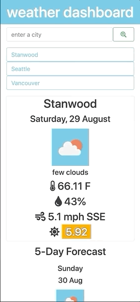

# Weather Dashboard

- [App Description](#app-description)
- [Link to site](#link-to-site)
- [In Use](#in-use)

## App Description

This app is designed to allow the user to search for a city in order to view the weather in that city. The main information displayed is the current weather; below that, the 5-day forecast is shown. Most recent searches (up to 8) are stored as buttons for easy access.

The linked API offers some correction capabilities for searches similar enough to existing city names, but searches it is unable to run cause an error message to display, telling the user that their search could not be completed

## Link to site
[Weather Dashboard](https://theykay.github.io/weather-dashboard/)

## In Use

